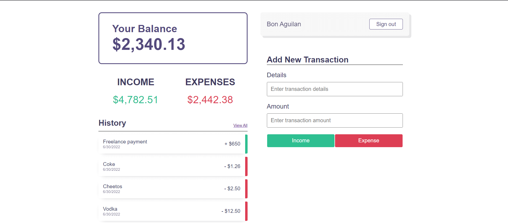
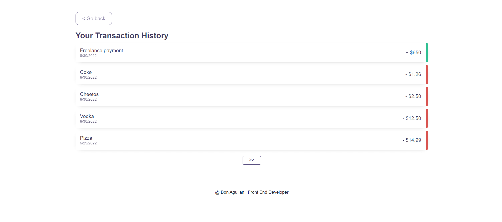

# React + Firebase Expense Tracker App

## Demo

https://expense-tracker-sandy-two.vercel.app/
###### `Test using this test user`

email: test@gmail.com  
pw: test123 
## This Project I learned

React Styled Components  
Firebase Queries and its other Options  
Exercise of React hooks  

## Packages

react-router-dom  
react-hot-toast  
firebase  
styled-components  

### `How to use`

Clone repository  
run: npm install  
run: npm start   

## Some Pictures

